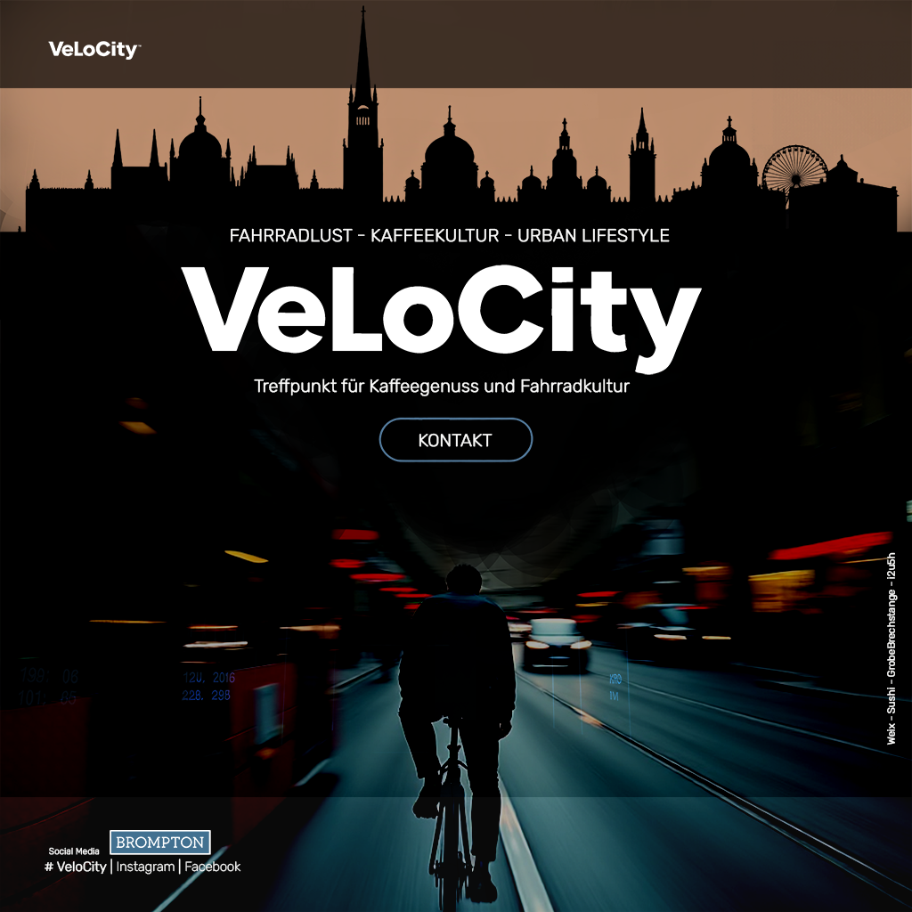
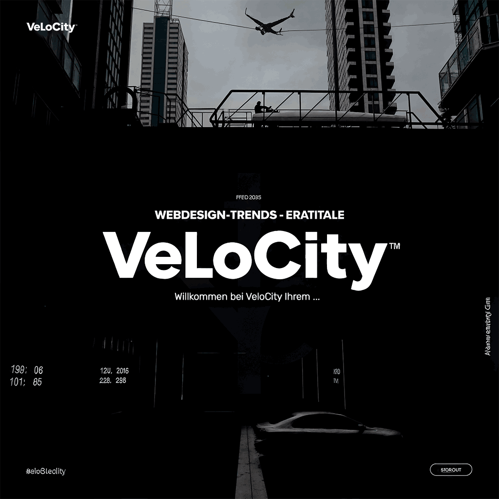

# V E L O C I T Y
## Bikes & Bohnen 
Fahrradladen Wien.

Erstellung: Website, Logo, ...
- Logo vektorisieren, neu erstellen
- Website
  - Stil - Brutalism 
  - Bildmaterial - InvokeUi
  - Schriften - GoogleFonts: Rubik

V2 

V1 
---
[DTF](http://test090309a.free.nf)

GitHub: VisualStudio Code -> 
        Lokal bearbeiten,
        speichern, 
        commiten (Betreff mit Beschreibung) 
        **SYNCRONISIEREN**

[ ] | [x]
.